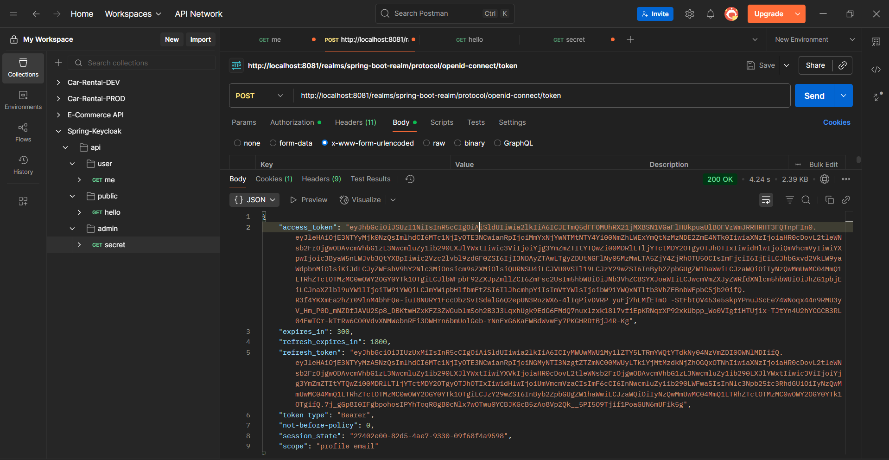

# Spring Boot 3 + Keycloak (Docker) + Swagger + CI/CD

  

A production‑ready starter integrating **Spring Boot 3** with **Keycloak** for authentication/authorization, documented with **Swagger/OpenAPI**, containerized with **Docker Compose**, and automated via **GitHub Actions** (build, test, Docker image publish, bundle zip).

> TL;DR: `docker compose up -d --build` → open **http://localhost:8080/swagger-ui.html**

---

## Table of Contents
1. [Overview](#overview)
2. [Quick Start](#quick-start)
3. [Keycloak Basics](#keycloak-basics)
4. [Getting a Token](#getting-a-token)
5. [Calling the APIs](#calling-the-apis)
6. [Swagger with OAuth2](#swagger-with-oauth2)
7. [Configuration](#configuration)
8. [CI/CD Pipeline](#cicd-pipeline)
9. [Project Structure](#project-structure)
10. [Troubleshooting](#troubleshooting)
11. [License](#license)

---

## Overview

- **Tech**: Java 17, Spring Boot 3.x, Maven
- **Auth**: Keycloak (containerized), OAuth2 Resource Server (JWT)
- **Docs**: springdoc-openapi (Swagger UI at `/swagger-ui.html`)
- **Ops**: Docker Compose brings up Postgres, Keycloak (with **auto-imported realm**), and the API
- **Automation**: GitHub Actions builds/tests, publishes Docker image to GHCR, and uploads a repo ZIP artifact

Auth flow (simplified):

```
[User] -> (login) -> [Keycloak] -> (JWT) -> [Spring Boot API] -> /api/user | /api/admin
```

---

## Quick Start

### A) Everything via Docker (recommended)

```bash
# 1) Build & start Postgres, Keycloak, and the API
docker compose up -d --build

# 2) Open Swagger
# On macOS:
open http://localhost:8080/swagger-ui.html
# On Linux:
xdg-open http://localhost:8080/swagger-ui.html
# On Windows (PowerShell):
start http://localhost:8080/swagger-ui.html

# 3) Keycloak admin console
# admin / admin
open http://localhost:8081
```

### B) Local app + Dockerized Keycloak

```bash
# Start Keycloak & Postgres only
docker compose up -d keycloak kcdb

# Run the app locally (Java 17 & Maven required)
mvn spring-boot:run
```

---

## Keycloak Basics

- **Realm**: an isolated space for users/clients/roles → `spring-boot-realm`
- **Client**: an application registered in the realm → `spring-boot-api` (confidential)
- **Roles**: realm roles `USER`, `ADMIN`
- **Users** (demo):
  - `user1` / `user1pass` → role `USER`
  - `admin1` / `admin1pass` → roles `USER`, `ADMIN`

This repo ships a **realm export** at `keycloak/realm-export.json` and Keycloak will **auto-import** it on container startup.

Keycloak URL: `http://localhost:8081`  
Issuer (OIDC): `http://localhost:8081/realms/spring-boot-realm`

---

## Getting a Token

### 1) Password Grant (demo/dev only)

> Uses a confidential client with **Direct Access Grants** enabled.

```bash
# Replace client_secret if you changed it in the realm export (default: secret123)
CLIENT_ID="spring-boot-api"
CLIENT_SECRET="secret123"
USERNAME="user1"
PASSWORD="user1pass"

TOKEN=$(curl -s -X POST "http://localhost:8081/realms/spring-boot-realm/protocol/openid-connect/token"   -H "Content-Type: application/x-www-form-urlencoded"   -d "grant_type=password"   -d "client_id=${CLIENT_ID}"   -d "client_secret=${CLIENT_SECRET}"   -d "username=${USERNAME}"   -d "password=${PASSWORD}" | jq -r .access_token)

echo "$TOKEN"
```

### 2) Authorization Code (browser)

1. In Keycloak Admin Console, confirm the client `spring-boot-api` is enabled and has a valid redirect URI (e.g., `http://localhost:8080/*`).
2. From Swagger UI, click **Authorize**, enter:
   - **Issuer**: `http://localhost:8081/realms/spring-boot-realm`
   - **Client ID**: `spring-boot-api`
   - **Client Secret**: `secret123`
3. Complete login as `user1` / `user1pass` or `admin1` / `admin1pass` and try secured endpoints.

> In production, prefer Authorization Code with PKCE and avoid password grant.

---

## Calling the APIs

```bash
# Public (no token required)
curl http://localhost:8080/api/public

# User (requires role USER)
curl -H "Authorization: Bearer $TOKEN" http://localhost:8080/api/user

# Admin (requires role ADMIN)
curl -H "Authorization: Bearer $TOKEN" http://localhost:8080/api/admin
```

---

## Swagger with OAuth2

Swagger UI is available at **/swagger-ui.html**. You can paste a token manually via **Authorize**, or configure OAuth fields (client ID/secret) there and complete the flow in-browser.

---

## Configuration

The API validates JWTs against the issuer:

| Property | Local | Docker profile |
|---|---|---|
| `spring.security.oauth2.resourceserver.jwt.issuer-uri` | `http://localhost:8081/realms/spring-boot-realm` | `http://keycloak:8080/realms/spring-boot-realm` |

Profiles:
- **default**: for local dev
- **docker**: used when running inside Docker (`SPRING_PROFILES_ACTIVE=docker`)

---

## CI/CD Pipeline

GitHub Actions workflow (`.github/workflows/ci.yml`) runs on PRs and pushes to `main`:

- **Build & Test** (`mvn verify`)
- **Docker Build & Push** to GitHub Container Registry (GHCR):  
  `ghcr.io/<owner>/spring-boot-keycloak-starter:{latest|<sha>}`
- **Bundle ZIP** artifact of the repository

To pull the image (after a push to `main`):

```bash
docker pull ghcr.io/<your-gh-username>/spring-boot-keycloak-starter:latest
```

> Make sure your repo has **Packages** write permission enabled for the Actions token.

---

## Project Structure

```
.
├─ .github/workflows/ci.yml
├─ Dockerfile
├─ docker-compose.yml
├─ keycloak/
│  └─ realm-export.json
├─ src/
│  ├─ main/
│  │  ├─ java/com/example/keycloakspring/
│  │  │  ├─ KeycloakSpringApplication.java
│  │  │  └─ config/
│  │  │     ├─ SecurityConfig.java
│  │  │     └─ JwtRoleConverter.java
│  │  └─ resources/
│  │     ├─ application.yml
│  │     └─ application-docker.yml
│  └─ test/java/com/example/keycloakspring/
│     ├─ PublicControllerTest.java
│     ├─ UserControllerTest.java
│     └─ AdminControllerTest.java
└─ pom.xml
```

---

## Troubleshooting

- **Keycloak not ready yet** → the API depends on Keycloak health; give it a few seconds, or run `docker compose logs keycloak -f`.
- **401 Unauthorized** → ensure you used a **valid JWT** from this realm and the client has correct secret.
- **403 Forbidden** → your user lacks required role. Use `admin1` for `/api/admin`.
- **Token audience/issuer mismatch** → confirm issuer matches `application.yml` and tokens are from `spring-boot-realm`.

---


---

## Screenshots & Diagrams

Below are some helpful images to better understand the project:

### Public Endpoint


### User Role


### Admin Role


### Token Flow


### JWT Debugger


### Swagger UI


### Database Schema


### Docker Desktop


### Code Sample


### GitHub Actions Workflow


## License

This project is licensed under the MIT License.
